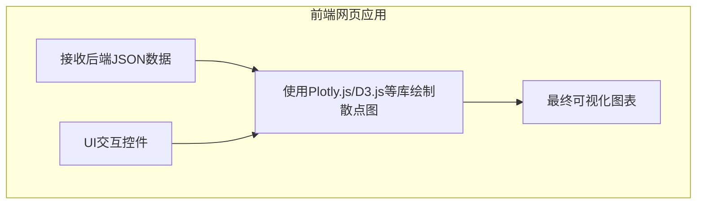

# 需求纪要：MOF数据t-SNE交互式可视化

## 1. 项目目标

将一份包含四种MOF（金属有机框架）分类的CSV数据，进行t-SNE降维可视化，并最终以一个可实时交互的网页应用形式展示，以便用户探索四种MOF类别的分布情况和调整可视化参数。

## 2. 核心实现流程

整个项目分为后端数据处理和前端交互式可视化两个主要部分。

### 2.1. 后端数据处理流水线

```mermaid
graph TD
    A[1. 加载CSV数据] --> B{2. 数据预处理};
    B --> C[分离描述/标签列];
    B --> D[挑选数值特征];
    D --> E[3. PCA降维预处理<br>(例如降至50维)];
    E --> F[4. t-SNE降维<br>(支持多种Perplexity值)];
    F --> G[5. 生成二维坐标及相关数据];
```

**详细步骤说明:**

1.  **加载CSV数据**: 读取用户提供的CSV文件。
2.  **数据预处理**:
    *   **分离数据**: 将数据明确分为三部分：
        *   **描述性数据**: 如 `mofid`, `DOI`, `Source` 等，不参与计算，但可用于最终在图上悬浮显示。
        *   **类别标签**: 标识MOF属于四种分类中哪一种的列。
        *   **数值特征**: 所有反映材料内在性质的数值列，将作为计算的输入。
    *   **特征选择**: 排除所有非数值、身份标识、或描述性的列。
3.  **PCA降维预处理**: 
    *   将挑选出的高维数值特征通过PCA进行降维（推荐降至50维），以达到去噪和加速计算的目的。
4.  **t-SNE降维**:
    *   将PCA降维后的主成分作为t-SNE的输入。
    *   程序应支持使用多组不同的Perplexity值（如10, 30, 50）进行计算，以便比较和选择最优结果。
5.  **生成最终数据**: 
    *   输出一个结构化的数据格式（如JSON），包含每个数据点的二维坐标、原始类别标签、以及用于悬浮提示的ID或其他描述信息。

### 2.2. 前端交互式可视化



**功能要求:**

1.  **基础绘图**: 根据后端传递的二维坐标和类别标签，绘制彩色散点图。
2.  **信息悬浮 (Hover)**: 当鼠标悬停在图上的某个数据点时，应能显示该点的详细信息（如MOF ID）。
3.  **实时交互控件**: 网页必须提供以下UI控件，允许用户实时调整图表样式而无需重新计算：
    *   **配色方案**: 为四个类别提供调色板或颜色选择器，允许用户自定义每个类别的颜色。
    *   **图例与标签**: 提供输入框或滑块，用于调整图表标题、坐标轴标签、图例的字体大小和粗细。
    *   **点的样式**: 提供下拉菜单，允许为每个类别选择不同的标记形状（如圆形、方形、十字形等）。
4.  **(可选高级功能)** **参数可调**: 提供输入框允许用户调整t-SNE的Perplexity等参数，并设置一个“重新计算”按钮来触发后端重新执行整个计算和可视化流程。
5.  **导出图像**: 提供一键导出当前可视化图像功能，至少支持PNG与SVG两种格式；可配置分辨率/尺寸、背景（透明或白色）、文件名，并保证导出图与当前交互状态（颜色、标记形状、标题与字号等）一致。

## 3. 交付物

- **后端**: 一个能够执行上述数据处理流水线并提供数据接口的Python服务或脚本。
- **前端**: 一个能够接收数据并实现上述所有交互式可视化功能的HTML/CSS/JavaScript网页应用。
- **最终产出**: 一个可以本地运行的、完整的Web应用，支持将可视化结果导出为PNG/SVG图像（含可配置分辨率、背景与文件名）。
