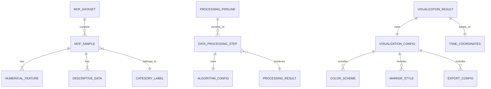
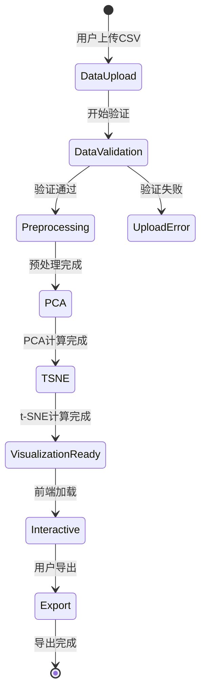

# Data Model: MOF数据t-SNE交互式可视化

## 实体关系图



## 核心实体定义

### 1. MOF数据实体

#### MOFDataset (MOF数据集)
**描述**: 用户上传的完整MOF数据集
**属性**:
- `dataset_id`: UUID - 数据集唯一标识符
- `filename`: String - 原始文件名
- `upload_timestamp`: DateTime - 上传时间
- `total_rows`: Integer - 总行数
- `total_columns`: Integer - 总列数
- `file_size_bytes`: Integer - 文件大小
- `encoding`: String - 文件编码
- `separator`: String - 分隔符
- `data_quality_score`: Float - 数据质量评分 (0-1)

**验证规则**:
- 文件大小 <= 100MB
- 支持的编码: UTF-8, GBK, ASCII
- 必须包含数值列和分类列
- 文件格式必须为CSV

#### MOFSample (MOF样本)
**描述**: 单个MOF材料样本
**属性**:
- `sample_id`: String - 样本唯一标识符 (通常为mofid)
- `dataset_id`: UUID - 所属数据集ID
- `row_index`: Integer - 在数据集中的行索引
- `category_label`: String - 分类标签 (四种MOF类别之一)
- `category_id`: Integer - 分类ID (1-4)
- `is_valid`: Boolean - 数据是否有效
- `validation_errors`: String[] - 验证错误列表

**验证规则**:
- sample_id必须唯一
- category_label必须是预定义的四种类型之一
- 数值特征不能全部为空

#### NumericalFeature (数值特征)
**描述**: MOF样本的数值特征向量
**属性**:
- `feature_id`: UUID - 特征ID
- `sample_id`: String - 关联的样本ID
- `feature_name`: String - 特征名称
- `feature_value`: Float - 特征值
- `is_missing`: Boolean - 是否缺失值
- `imputed_value`: Float - 插补后的值
- `normalized_value`: Float - 标准化后的值
- `z_score`: Float - Z分数
- `is_outlier`: Boolean - 是否为异常值

**验证规则**:
- feature_value在合理范围内
- 标准化值应在[-3, 3]范围内
- 缺失值率 < 30%

#### DescriptiveData (描述性数据)
**描述**: MOF样本的描述信息
**属性**:
- `data_id`: UUID - 描述数据ID
- `sample_id`: String - 关联的样本ID
- `field_name`: String - 字段名称 (如DOI, Source)
- `field_value`: String - 字段值
- `data_type`: String - 数据类型 (text, url, identifier)

#### CategoryLabel (分类标签)
**描述**: MOF分类标签定义
**属性**:
- `category_id`: Integer - 分类ID (1-4)
- `category_name`: String - 分类名称
- `display_name`: String - 显示名称
- `color_code`: String - 颜色代码
- `description`: String - 分类描述
- `sample_count`: Integer - 该类别的样本数量

### 2. 数据处理流水线实体

#### ProcessingPipeline (处理流水线)
**描述**: 数据处理流水线实例
**属性**:
- `pipeline_id`: UUID - 流水线ID
- `dataset_id`: UUID - 处理的数据集ID
- `start_time`: DateTime - 开始时间
- `end_time`: DateTime - 结束时间
- `status`: String - 状态 (pending, running, completed, failed)
- `progress_percentage`: Float - 进度百分比 (0-100)
- `error_message`: String - 错误信息
- `total_duration_ms`: Integer - 总耗时(毫秒)

#### DataProcessingStep (处理步骤)
**描述**: 数据处理的具体步骤
**属性**:
- `step_id`: UUID - 步骤ID
- `pipeline_id`: UUID - 所属流水线ID
- `step_name`: String - 步骤名称
- `step_type`: String - 步骤类型 (preprocessing, pca, tsne)
- `start_time`: DateTime - 开始时间
- `end_time`: DateTime - 结束时间
- `status`: String - 状态
- `input_rows`: Integer - 输入行数
- `output_rows`: Integer - 输出行数
- `memory_usage_mb`: Float - 内存使用量
- `cpu_usage_percent`: Float - CPU使用率

#### AlgorithmConfig (算法配置)
**描述**: 算法配置参数
**属性**:
- `config_id`: UUID - 配置ID
- `step_id`: UUID - 关联的处理步骤ID
- `algorithm_name`: String - 算法名称
- `parameters`: JSON - 算法参数
- `version`: String - 算法版本

**t-SNE参数示例**:
```json
{
  "perplexity": 30,
  "n_components": 2,
  "learning_rate": 200,
  "n_iter": 1000,
  "random_state": 42,
  "metric": "euclidean"
}
```

**PCA参数示例**:
```json
{
  "n_components": 50,
  "whiten": false,
  "svd_solver": "auto",
  "random_state": 42
}
```

#### ProcessingResult (处理结果)
**描述**: 处理步骤的结果数据
**属性**:
- `result_id`: UUID - 结果ID
- `step_id`: UUID - 关联的处理步骤ID
- `result_type`: String - 结果类型
- `data`: JSON - 结果数据
- `metadata`: JSON - 元数据
- `file_path`: String - 结果文件路径

### 3. 可视化配置实体

#### VisualizationConfig (可视化配置)
**描述**: 可视化配置
**属性**:
- `config_id`: UUID - 配置ID
- `pipeline_id`: UUID - 关联的流水线ID
- `chart_title`: String - 图表标题
- `x_axis_label`: String - X轴标签
- `y_axis_label`: String - Y轴标签
- `width`: Integer - 图表宽度
- `height`: Integer - 图表高度
- `show_legend`: Boolean - 是否显示图例
- `created_at`: DateTime - 创建时间

#### ColorScheme (颜色方案)
**描述**: 颜色配置
**属性**:
- `scheme_id`: UUID - 方案ID
- `config_id`: UUID - 关联的配置ID
- `category_id`: Integer - 分类ID
- `color_hex`: String - 十六进制颜色值
- `opacity`: Float - 透明度 (0-1)
- `border_color`: String - 边框颜色

#### MarkerStyle (标记样式)
**描述**: 数据点样式配置
**属性**:
- `style_id`: UUID - 样式ID
- `config_id`: UUID - 关联的配置ID
- `category_id`: Integer - 分类ID
- `marker_type`: String - 标记类型 (circle, square, triangle, diamond)
- `size`: Integer - 标记大小
- `line_width`: Integer - 边框宽度

#### ExportConfig (导出配置)
**描述**: 导出配置
**属性**:
- `export_id`: UUID - 导出ID
- `config_id`: UUID - 关联的配置ID
- `format`: String - 格式 (png, svg, pdf)
- `width`: Integer - 导出宽度
- `height`: Integer - 导出高度
- `dpi`: Integer - 分辨率
- `background_color`: String - 背景颜色
- `filename`: String - 文件名

### 4. 可视化结果实体

#### VisualizationResult (可视化结果)
**描述**: 最终可视化结果
**属性**:
- `visualization_id`: UUID - 可视化ID
- `pipeline_id`: UUID - 关联的流水线ID
- `config_id`: UUID - 使用的配置ID
- `created_at`: DateTime - 创建时间
- `chart_data`: JSON - 图表数据
- `total_samples`: Integer - 总样本数
- `render_time_ms`: Integer - 渲染时间

#### TSNECoordinates (t-SNE坐标)
**描述**: t-SNE降维后的二维坐标
**属性**:
- `coordinate_id`: UUID - 坐标ID
- `visualization_id`: UUID - 关联的可视化ID
- `sample_id`: String - 样本ID
- `x_coordinate`: Float - X坐标
- `y_coordinate`: Float - Y坐标
- `distance_to_center`: Float - 到中心的距离
- `local_density`: Float - 局部密度

## 数据流状态转换

### 数据处理状态机


### 错误处理状态
- `UploadError`: 文件格式错误、编码问题、大小超限
- `ValidationError`: 数据不完整、格式错误、缺少必要列
- `ProcessingError`: 内存不足、算法失败、超时
- `VisualizationError`: 渲染失败、浏览器兼容性问题

## API契约设计

### 输入验证规则
1. **文件上传验证**:
   - 最大文件大小: 100MB
   - 支持格式: CSV
   - 编码检测: 自动检测UTF-8/GBK/ASCII
   - 结构验证: 必须包含数值列和分类列

2. **参数验证**:
   - perplexity: 5-50范围
   - PCA维度: 2-100或保留95%方差
   - 图表尺寸: 合理的像素范围
   - 颜色值: 有效的十六进制格式

3. **数据质量验证**:
   - 缺失值率 < 30%
   - 数值范围合理性检查
   - 重复样本检测
   - 异常值识别和标记

## 性能考虑

### 内存优化
- 使用分块处理大文件
- 及时释放中间结果
- 内存映射技术
- 垃圾回收优化

### 计算优化
- 并行化独立计算步骤
- 缓存常用计算结果
- 懒加载策略
- 进度反馈机制

### 存储优化
- 临时文件自动清理
- 压缩存储中间结果
- 定期清理过期数据
- 备份重要结果

此数据模型设计完全符合SDD Constitution的Library-First原则，每个实体都可以独立测试和复用，同时支持CLI接口和完整的日志记录功能。